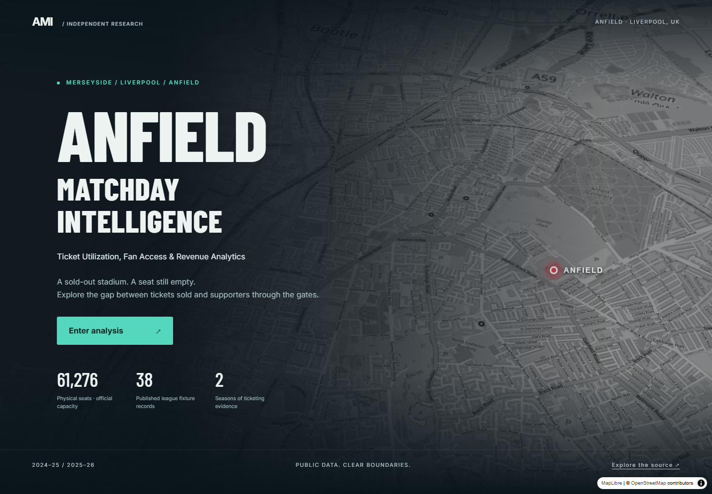
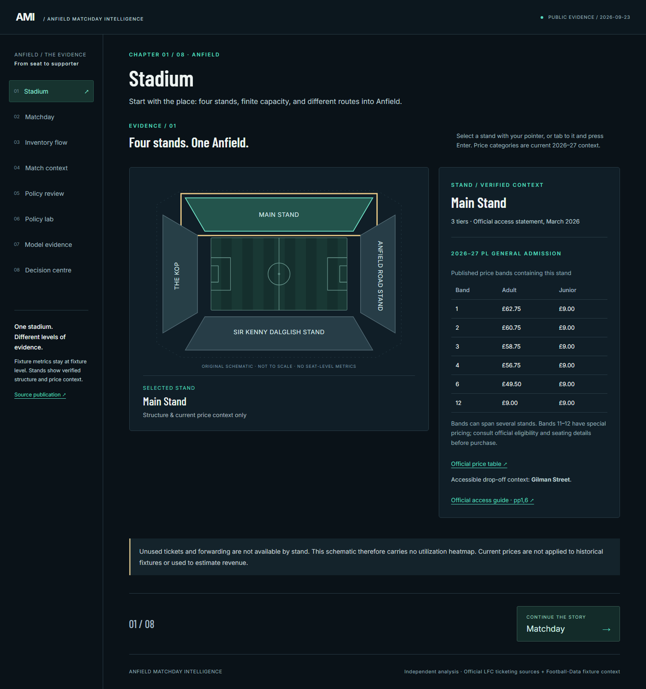
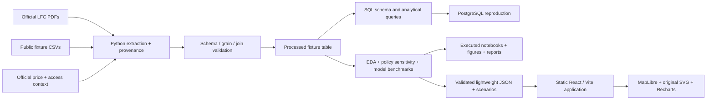

# ANFIELD MATCHDAY INTELLIGENCE

### Ticket Utilization, Fan Access & Revenue Analytics

**A sold-out stadium does not guarantee a used seat.** This executed data-science project investigates how Anfield's limited ticket inventory translates into supporter access, and presents the evidence through an original interactive Anfield experience.



**38 verified league fixture records · 2 seasons · 6 executed notebooks · Python + SQL + React**

**Deployment:** static build is ready; public URL pending owner merge and GitHub Pages activation. [Exact deployment steps](docs/DEPLOYMENT.md). No live deployment is claimed.

## The business problem

> How efficiently is Anfield's limited ticket inventory being used, and what patterns in ticket access, forwarding, unused seats, pricing, and match context could help improve ticketing decisions?

Demand exceeds finite matchday inventory, yet some sold tickets go unused. The opportunity is to help more supporters attend through better use of forwarding, the official exchange and ticketing policy. This is a capacity and access problem with revenue implications, rather than a generic ticket-price predictor.

I have supported Liverpool since I was around five years old. This project connects that long-standing interest with data science, revenue management and evidence-based decisions. The [original specification](docs/ORIGINAL_SPECIFICATION.md) is preserved.

## What the executed analysis found

| Evidence | Verified result | Interpretation boundary |
|---|---|---|
| Published league unused-ticket means | 1,465.53 in 2024–25; 1,516.89 in 2025–26 | Older PDF says all stadium tickets; newer PDF says home tickets. Scope equivalence is unconfirmed. |
| Same-opponent comparison | 16 common opponents; mean difference −1.625 tickets | Opponent bootstrap 95% interval −386.13 to +366.94. Descriptive sensitivity, not a policy effect. |
| 2025–26 forwarding | Mean 9,925.53 tickets per league home match | No comparable fixture-level forwarding series for 2024–25. |
| Club-reported policy observation | 23% fewer empty GA season-ticket seats | Specific subgroup; attributed to the club, not independently identified causally here. |
| Context model benchmark | Ridge MAE 454.30 vs expanding-mean MAE 436.51 tickets | Nine held-out fixtures; added complexity did not improve this evaluation. |
| Fulham recovery scenario | 25% of 2,820 unused tickets → 705 supporter opportunities | **SCENARIO — NOT OBSERVED DATA.** No incremental revenue claim. |

Full evidence and allowed résumé language: [VERIFIED_PORTFOLIO_CLAIMS.md](VERIFIED_PORTFOLIO_CLAIMS.md).

## Data and measurement

Primary sources are Liverpool FC's [2024–25 publication](https://www.liverpoolfc.com/news/liverpool-fc-matchday-ticketing-data-2024-25-season) and [2025–26 publication](https://www.liverpoolfc.com/news/lfc-matchday-ticketing-data-2025-26-season), with their linked detailed PDFs. Official price, stadium access and policy documentation supplies contextual facts. Football-Data.co.uk supplies fixture dates and kickoff times only.

- **Fixture grain:** 19 league unused-ticket counts per season; forwarding for the 19 newer-season fixtures.
- **Season × competition grain:** 2025–26 cup averages, never expanded into invented cup match rows.
- **Stand / price-category grain:** four stands, verified tiers/access information, and clearly dated 2026–27 price bands. The historical pricing link now redirects to current prices; historical stand rates are not inferred.
- **Policy subgroup grain:** publisher-reported change for GA season-ticket holders, kept separate from overall fixture counts.

Exact sold-ticket denominators, complete turnstile attendance, exchange listings/conversion, and stand-level ticket behavior are unavailable. Physical capacity is 61,276, but `unused / capacity` is a context ratio, **not an occupancy or no-show rate**. Forwarding is not proof of attendance. Already-sold unused tickets are not automatically lost ticket revenue.

[Data provenance](DATA_PROVENANCE.md) · [Data dictionary](docs/DATA_DICTIONARY.md) · [Frozen data contract](docs/DATA_CONTRACT.md)

## Interactive application



The React + Vite application contains an Anfield-specific map arrival and eight connected analytical views:

1. **Stadium:** arrival opens an original keyboard-accessible SVG; all four stands reveal verified structural and current pricing context.
2. **Matchday:** season/fixture controls, selected-match chart highlight, fixture-specific tooltips and accessible data table.
3. **Inventory flow:** clearly labelled process diagram, with no invented quantitative Sankey paths.
4. **Match context:** competition means, weekday/weekend groups, retrospective forwarding scatter and distinct member-access denominators.
5. **Policy review:** subgroup observation, raw contrasts, comparable opponents, uncertainty and confounders.
6. **Policy lab:** Python-precomputed 0–100% recovery scenarios; no unsupported revenue calculation.
7. **Model evidence:** forward-only baseline comparison and the decision not to deploy an ARIMA or operational forecast.
8. **Decision centre:** testable operational questions and the measurements needed to answer them.

Dark navy, restrained mint and red accents, condensed typography and original vectors create a sports-broadcast feel without copying a broadcaster or club interface. The map fly-to respects reduced motion; mobile navigation scrolls horizontally; charts have data-table alternatives. No club photography, crest assets, audio or game simulation is shipped.

The final product pass connects the eight chapters with previous/next navigation, gives mobile arrival its own geographic frame, and separates hypothetical recovery visually from observed counts. [Page-by-page visual QA and screenshot gallery](reports/PRODUCT_VISUAL_QA.md).

## Architecture



```text
analysis/            acquisition, extraction, validation, policy, modelling, export
data/curated/        explicit source transcriptions and crest-order audit
data/raw/            ignored local source snapshots
data/processed/      validated fixture table and summaries
validation/          frontend JSON Schema
sql/                 normalized schema, generated seed, meaningful queries
notebooks/           six executed narrative analyses
reports/             model/policy/SQL outputs and original figures/screenshots
tests/               analytical regression and integrity tests
app/                 static React experience, production browser tests
docs/                contract, dictionary, audits, reproduction, deployment
```

## Analytical methods

The pipeline extracts numeric PDF tables with PyMuPDF, visually reconciles crest-based opponent labels, normalizes names and validates one-to-one context joins. It checks row counts, seasons, nulls, integer ticket units, duplicate fixtures, published rounded means and data grain before exporting.

Descriptive analysis compares published fixture counts and competition means. Policy analysis includes a 16-opponent paired comparison and seeded 10,000-resample bootstrap. It does **not** claim causal identification: opponent matching cannot control schedule, season performance, overlapping policies or reporting scope changes.

The predictive experiment uses only the 19 newer-season records with a consistent target description. Three expanding windows train on 10/13/16 fixtures and test the next three, comparing an expanding mean, last-fixture forecast and fixed-alpha ridge. Pre-match context is limited to weekend, scheduled kickoff and ballot eligibility; realized forwarding and match results are excluded. Scaling is learned within each fold.

ARIMA/SARIMA is not justified by one comparable season, 5–29-day irregular intervals and no established seasonal structure or stationarity. The project retains descriptive trends and a modest fixture benchmark instead. [Model and leakage audit](docs/MODEL_AND_LEAKAGE_AUDIT.md).

## SQL and PostgreSQL

The normalized schema separates fixtures, one-to-one ticket metrics, competition aggregates, stands and multi-stand price categories. Four SQL analyses cover season/competition summaries, match rankings and comparable opponents. Query results were executed locally in SQLite and PostgreSQL WASM (PGlite) and reconciled cell by cell. A psycopg workflow supports native PostgreSQL in a dedicated schema; CI provisions PostgreSQL 17. The public frontend needs no live database.

## Reproduce

Python 3.12, Node 24 and pnpm 11.19.0 are the reference runtimes.

```sh
python -m venv .venv
# Activate: source .venv/bin/activate (macOS/Linux)
# or .venv\Scripts\Activate.ps1 (PowerShell)
pip install -r requirements.txt
python -m analysis.acquire
python -m analysis.pipeline
python -m pytest -q
python -m analysis.notebooks

cd app
pnpm install --frozen-lockfile
pnpm build
pnpm test:postgres
node node_modules/@playwright/test/cli.js install chromium
pnpm test
pnpm preview --port 4173
```

[Full reproduction, including PostgreSQL](docs/REPRODUCTION.md). Raw PDFs and source artwork are not committed; source URLs and hashes are. The application uses committed lightweight processed artifacts and works independently of the acquisition pipeline.

## Validation and limits

Executed locally: **28 analytical tests**, **six notebooks**, **four SQL queries on two engines**, **seven production-browser tests**, and the **Vite production build**. Browser checks cover the keyboard chapter journey at 320px, desktop/mobile navigation, fixture selection and tooltips, scenarios, reduced motion, overflow, font fallback, unavailable cup data, delayed loading, and map/data failure paths. Screenshots were visually inspected. See [validation report](reports/VALIDATION.md) for the precise scope; this is not a claim of full WCAG certification or exhaustive device coverage.

The sources are small, aggregate and partly definition-sensitive. Current price categories are not realized transaction prices. Cup averages have no fixture-level dispersion here. Revenue effects and policy causality cannot be identified. Map tiles/fonts need third-party availability; analytical assets have local fallbacks. No internal Liverpool data, private credentials or fictional stand metrics are used.

## Technology

Python · pandas · NumPy · scikit-learn · Matplotlib · PyMuPDF · Jupyter/nbclient · pytest · JSON Schema · SQL · PostgreSQL/psycopg · SQLite · PGlite · React · Vite · MapLibre GL · Recharts · Playwright · GitHub Actions

## Portfolio handoff

[HANDOFF.md](HANDOFF.md) contains the walkthrough, methods, verified results, deployment steps, two defensible résumé bullets, code reading guide, fifteen interview questions and future improvements.

Independent portfolio case study; not affiliated with Liverpool FC. Data and third-party assets retain their original rights. The next research priority is better measurement of how tickets become actual supporter attendance.
