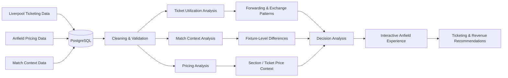

# Anfield Ticket Value & Revenue Intelligence

> A revenue analytics project examining how efficiently is Anfield's limited ticket inventory being used, and what patterns in ticket access, forwarding, unused seats, pricing, and match context could help improve ticketing decisions

## Project Overview

Anfield is one of the most recognizable football stadiums in the world and operates in an environment where demand for Liverpool FC tickets regularly exceeds the number of seats available.

At the same time, selling a ticket does not always mean that the seat is ultimately used. Tickets may be forwarded to other supporters, returned through a ticket exchange, or remain unused even after being sold. This creates an interesting problem for both the club and its supporters: **how can a stadium with limited capacity make better use of the seats it already has while balancing fan access and revenue?**

I have followed Liverpool since I was around five years old, so this project combines a long-standing personal interest with my growing interest in revenue management, customer behavior, data science, and decision-making.

The project will study Liverpool's matchday ticketing system as a **capacity and revenue-management problem** rather than simply attempting to predict ticket prices.

The main question is:

> **How efficiently is Anfield's limited ticket inventory being used, and what patterns in ticket access, forwarding, unused seats, pricing, and match context could help improve ticketing decisions?**

---

## The Problem

Football clubs have a fixed amount of inventory for each match: the seats inside the stadium.

Unlike a normal product, an unused seat after kickoff cannot be sold tomorrow. Its value for that match disappears.

Liverpool also has several different groups competing for access to that limited inventory, including season-ticket holders, members, hospitality customers, away supporters, and other allocations.

The problem therefore goes beyond simply asking:

> How much should a ticket cost?

It also includes questions such as:

* How many sold tickets actually result in occupied seats?
* How often are tickets forwarded to another supporter?
* How effectively does the ticket exchange return unwanted tickets to the market?
* Do utilization patterns differ depending on the opponent or competition?
* Are high-demand matches handled differently from lower-demand matches?
* Where might ticketing policy improve both supporter access and use of available capacity?

The objective is not to claim that there is one perfect ticketing strategy. Instead, the project will use available data to identify patterns and highlight areas where different decisions may deserve further testing.

---

## Data

The project will combine multiple sources rather than depending on a single dataset.

### Liverpool FC Matchday Ticketing Data

Liverpool publishes information about how its ticketing system is used across seasons.

This can provide measures such as:

* tickets forwarded to other supporters,
* tickets placed on or sold through the ticket exchange,
* sold tickets that remained unused,
* member access,
* ticket allocations,
* and other indicators of stadium utilization.

### Anfield Ticket Pricing

Official Liverpool FC pricing information will be used to understand how ticket prices differ across stands and ticket categories.

### Match Context

Match-level information can be added to describe the environment surrounding each fixture, including:

* opponent,
* competition,
* date,
* match result,
* rivalry or match importance where appropriate,
* and other useful match characteristics.

The datasets will be cleaned and connected using Python, SQL, and PostgreSQL so that ticketing behavior can be compared across matches and seasons.

---

## Analytical Approach

The first stage of the project will focus on understanding the ticketing system itself.

Exploratory analysis will compare metrics such as ticket forwarding, unused seats, exchange activity, and access across different fixtures.

From there, the analysis will investigate whether those patterns change depending on match context.

For example:

> Does a major Premier League fixture show different ticket utilization from an early-round cup match?

> Are more tickets forwarded for certain categories of matches?

> How many tickets remain unused even when demand for access remains high?

> How does the use of the ticket exchange vary across fixtures?

Where the data supports it, statistical models may be used to estimate how match characteristics relate to ticket utilization or other measurable outcomes.

The purpose of modeling will be to explain meaningful differences and support decisions rather than simply produce a prediction with the highest possible accuracy.

---

## Proposed System Flow

---

## Interactive Visualization

A major part of the finished project will be an interactive visual experience rather than a collection of static charts.

The proposed presentation begins from a wider geographical view and progressively moves toward the actual business problem.

### Stage 1 — Geographic View

The experience begins with a map showing the United Kingdom and then transitions toward northwest England.

The camera moves toward Liverpool and identifies the location of **Anfield** within the city.

Nearby football infrastructure, such as Everton's stadium, may also be shown for geographical context.

The purpose is not simply decoration. It gives someone unfamiliar with Liverpool an immediate understanding of where the stadium is and places the analysis in a real environment.

### Stage 2 — Liverpool to Anfield

The map then zooms further into the Anfield area.

The user can select the stadium to enter the main analytical view.

This would be designed as a lightweight interactive geographic experience using tools such as **Mapbox/MapLibre, pydeck, Plotly, or a similar mapping framework**, rather than attempting to recreate a full broadcast-quality 3D animation.

### Stage 3 — Stadium View

Once Anfield is selected, the experience transitions from the geographic map into a stadium-level visualization.

The stadium can be divided into its major stands, such as:

* The Kop
* Main Stand
* Sir Kenny Dalglish Stand
* Anfield Road Stand

Depending on the data available, the visualization can show information such as official ticket-price categories or other section-level measures.

A separate match panel can display fixture-level information such as:

* opponent,
* competition,
* ticket forwarding,
* ticket exchange activity,
* unused sold tickets,
* and other utilization measures.

The user could change the selected match or competition and see how the information changes.

The goal is to make the analysis understandable visually without requiring someone to read through a notebook or statistical output.

---

## Important Data Boundary

The visualization will only display information at the level actually supported by the data.

For example, if Liverpool publishes the number of unused tickets for an entire match but not for individual stadium sections, the project will **not invent section-level unused-seat estimates**.

Section-level graphics would show only information that can legitimately be connected to individual areas of the stadium, such as official pricing categories.

Match-level utilization statistics would remain clearly identified as match-level measures.

Maintaining that distinction is important because the goal is to create an impressive project without sacrificing analytical credibility.

---

## Tools

The expected core stack includes:

**Python · SQL · PostgreSQL · pandas · NumPy · statsmodels/scikit-learn · Plotly**

For the geographic and interactive visualization:

**MapLibre/Mapbox-style mapping, pydeck or Plotly**

Additional tools will only be added if they improve the final analysis or presentation.

The project is intentionally designed as a data-science project first. The interactive interface is the presentation layer for the analysis rather than the main technical objective.

---

## Expected Outcome

The completed project should provide a clearer picture of how Anfield's ticket inventory moves between initial allocation and actual matchday use.

The final analysis should be able to identify patterns such as:

* when and where ticket utilization appears weaker,
* how forwarding and exchange behavior changes across match types,
* whether different competitions produce meaningfully different behavior,
* and where ticketing policies might be tested to improve utilization.

The final recommendation will focus on the balance between:

**stadium utilization, supporter access, customer experience, and revenue efficiency.**

Rather than ending with a model score, the project should end with a decision-oriented question:

> **Given a stadium with extremely limited inventory and strong demand, what can Liverpool learn from how supporters actually use their tickets, and how could those insights help make better matchday ticketing decisions?**

That is the problem this project aims to explore.

## 17. Results

> To be completed after analysis.

No hypothetical accuracy, pricing, or revenue figures will be presented as real results.
