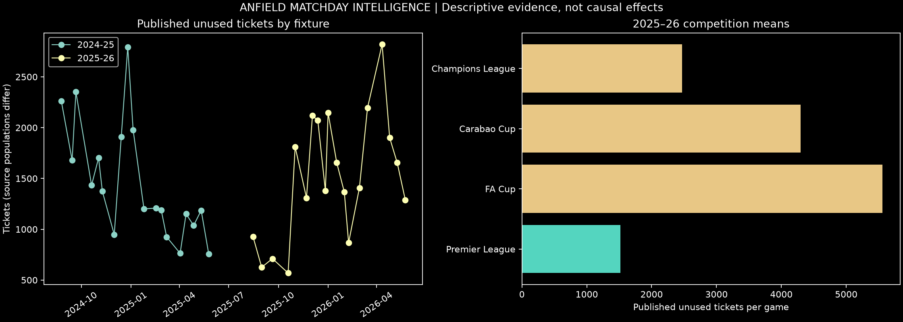
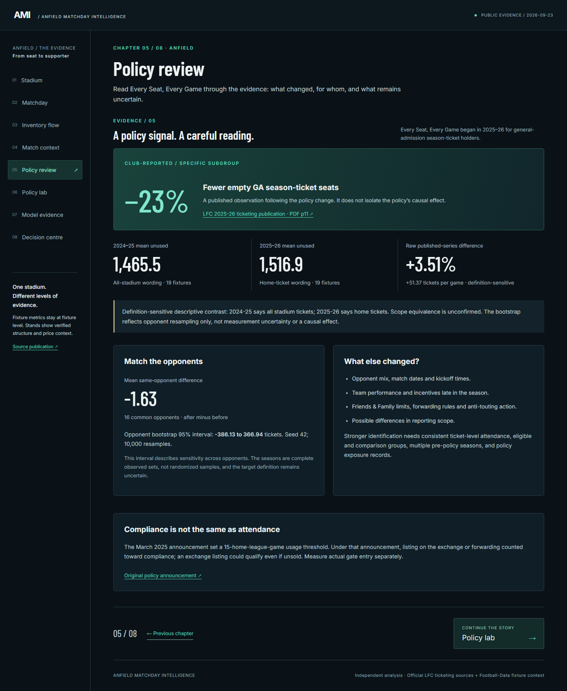
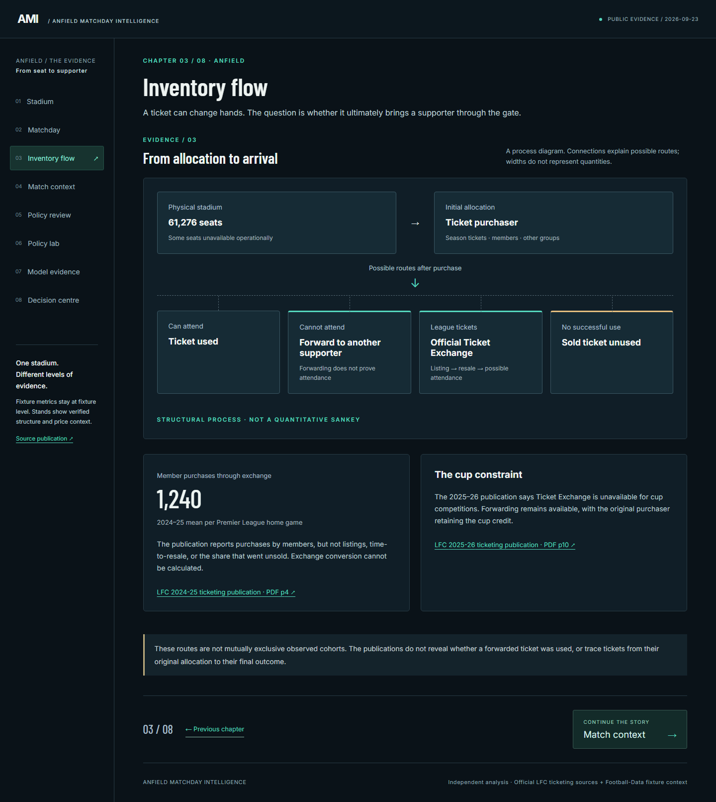
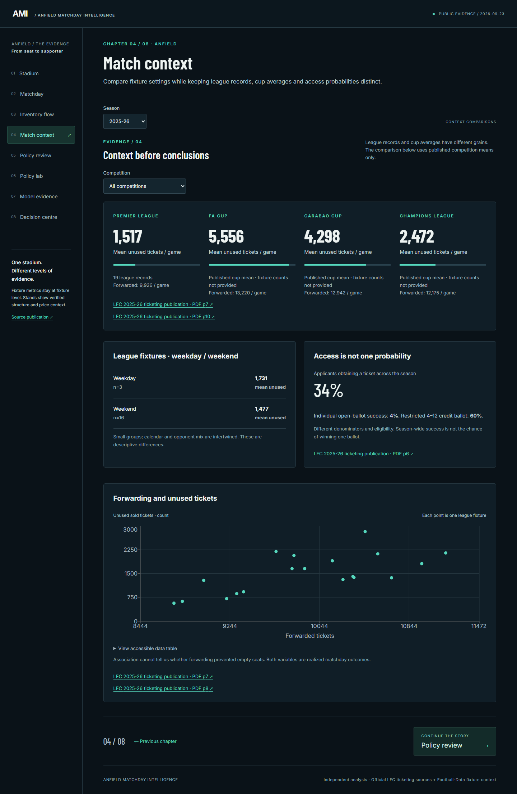
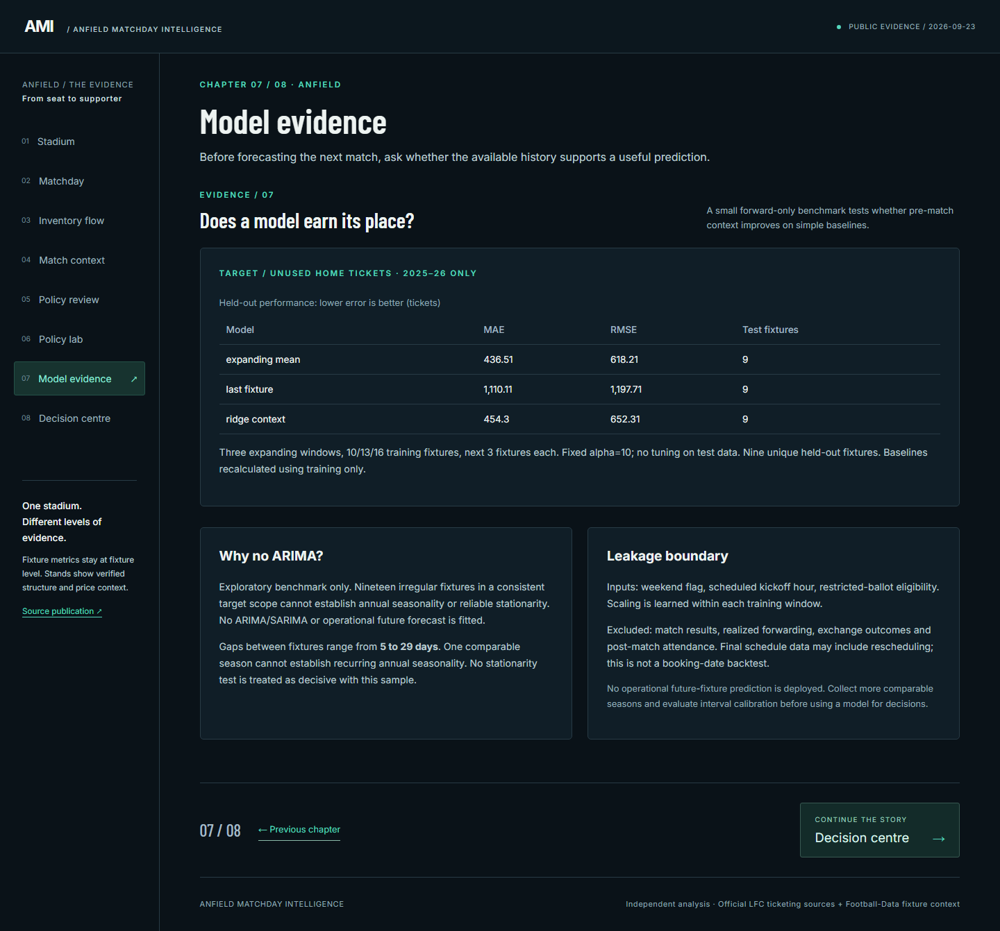
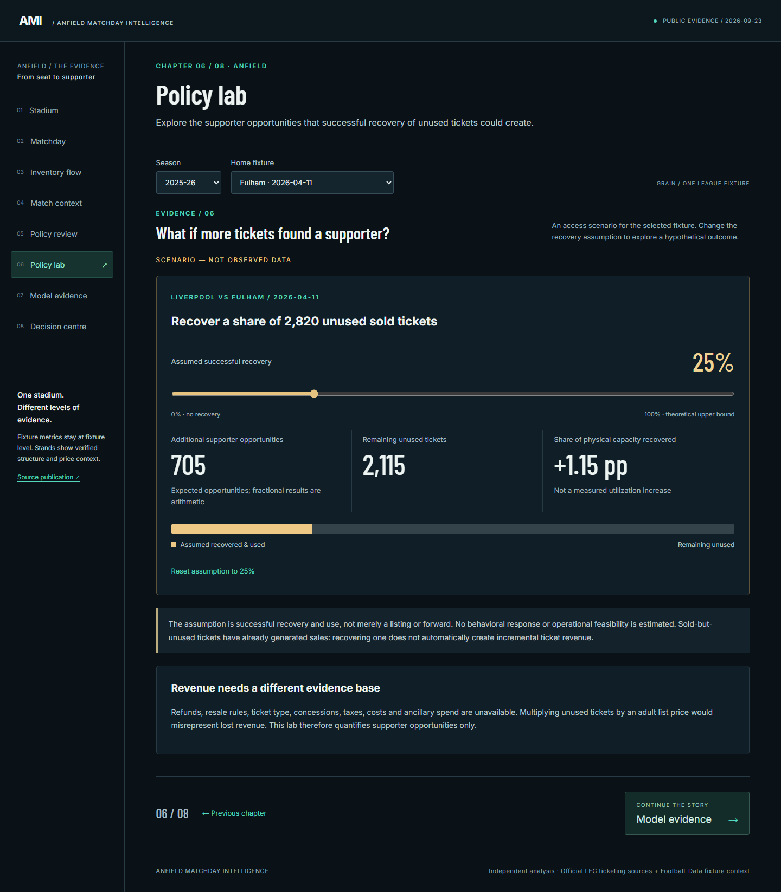
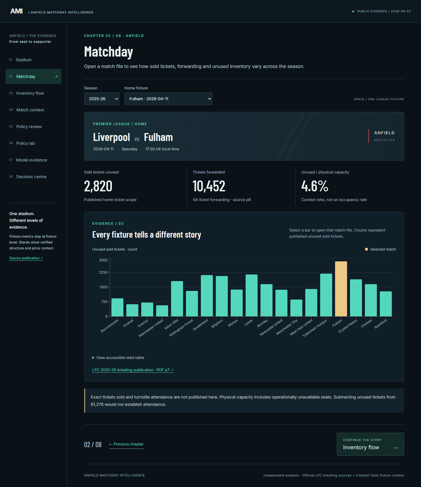
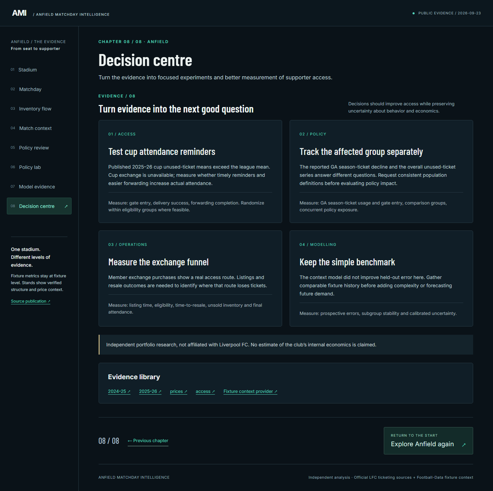

# Anfield Matchday Intelligence

  

<h3 align="center">Ticket Utilization, Fan Access & Revenue Analytics</h3>

## If you do not follow soccer, start here

**Liverpool FC** is a professional soccer club in England's **Premier League**, the top division of English soccer.  
**Anfield** is Liverpool's home stadium in Liverpool, England, with a published capacity of **61,276**.

The simplest way to think about this project is as an **inventory problem**.

A stadium has a fixed number of seats. Liverpool has more supporters who want access than seats available for many matches. Yet a ticket can still end up **unused** when the person holding it does not attend and the ticket is not successfully redistributed.

So a "sold-out" match does not necessarily mean every possible supporter opportunity was used.

Liverpool provides mechanisms such as **ticket forwarding** and the official **Ticket Exchange** to help move tickets from supporters who cannot attend to supporters who can. This project studies that system using public data.

> **Core question:** How efficiently is scarce matchday ticket inventory being used, and what evidence could help Liverpool get more supporters into available seats?

This is primarily a **fan-access and capacity-utilization problem**. Revenue is considered only where the available data can support it.

---

## The club context

For readers unfamiliar with Liverpool, these are some of the current attacking players around the club in the 2026–27 season. The images are included only to give the project human and sporting context; **player performance is not used in the analysis**.

<table>
<tr>
<td align="center" width="25%">
 <b>Florian Wirtz</b>
</td>
<td align="center" width="25%">
 <b>Alexander Isak</b>
</td>
<td align="center" width="25%">
 <b>Hugo Ekitike</b>
</td>
<td align="center" width="25%">
 <b>Bradley Barcola</b>
</td>
</tr>
</table>

Liverpool's recent history is also strongly associated with players such as **Mohamed Salah**, who left the club after the 2025–26 season following nine years at Anfield.

<em>Context only: official Liverpool FC-hosted imagery. No player-performance variables enter the project.</em>

---

## Why I built this

I have supported Liverpool since I was around five years old.

I wanted the project to be more than a generic sports dashboard or match predictor. The interesting question to me was what happens **around the game**: tickets, access, capacity, supporter behavior and the decisions needed to use a scarce stadium more efficiently.

That turned into a data-science project combining:

- business analytics
- revenue-management thinking
- supporter-access analysis
- policy evaluation
- forecasting discipline
- SQL
- data validation
- product design
- experimentation ideas

The original specification is preserved in [docs/ORIGINAL_SPECIFICATION.md](docs/ORIGINAL_SPECIFICATION.md).

---

# See the product before the analysis

The analysis is presented through an original React application rather than only notebooks.

## 1. Arrival: where is Anfield?

  

The opening screen gives a reader geographic context before showing any ticket metrics. It locates **Anfield in Liverpool, England** and acts as the entry point into the analytical experience.

This matters because the intended portfolio audience may not already know the club, the stadium, or the geography.

---

## 2. Stadium: what inventory are we talking about?

  

The next view introduces Anfield itself through an original interactive stadium schematic.

The four stands are:

- **The Kop**
- **Main Stand**
- **Sir Kenny Dalglish Stand**
- **Anfield Road Stand**

The view provides structural, access and current price-category context. It is **not** a seat-level utilization heatmap; public data is not available at that grain.

From here, the application moves into match-level ticket utilization, forwarding, policy evidence, scenarios and model evaluation.

---

# Project at a glance

| Area | Details |
|---|---|
| **Business problem** | Improve use of scarce matchday ticket inventory |
| **Venue** | Anfield, Liverpool, England |
| **Published capacity** | 61,276 |
| **League fixtures analyzed** | 38 |
| **Seasons** | 2024–25 and 2025–26 |
| **2025–26 forwarding records** | 19 Premier League home fixtures |
| **Primary sources** | Official Liverpool FC ticketing publications |
| **Fixture context** | Football-Data.co.uk dates and scheduled kickoff times |
| **Analysis** | Python, pandas, NumPy |
| **Modeling** | Ridge Regression + forecasting baselines |
| **Policy analysis** | Comparable opponents + bootstrap sensitivity analysis |
| **Database work** | SQL, SQLite, PostgreSQL/PGlite |
| **Product** | React, Vite, Recharts, MapLibre |
| **Testing** | pytest + Playwright |

---

# Questions this project answers

### Q1. How much published ticket inventory went unused across Premier League home matches?

### Q2. Did unused-ticket levels materially change between 2024–25 and 2025–26?

### Q3. What does ticket forwarding tell us about the scale of ticket reallocation?

### Q4. Can pre-match context predict unused tickets better than a simple historical benchmark?

### Q5. If some unused tickets could be recovered, how many additional supporter opportunities could potentially be created?

### Q6. What additional data would be required to make stronger ticketing, experimentation and revenue decisions?

The structure deliberately separates:

**measurement → comparison → prediction → scenario analysis → operational decision-making**

---

# 1. The business problem

Anfield has finite capacity and high demand for match access.

Yet Liverpool's official publications show that some tickets associated with home matches still go unused.

That creates several related questions.

### Supporter access

Could forwarding, Ticket Exchange, communication or policy help move more tickets from people who cannot attend to supporters who want to be there?

### Operations

Which fixtures or contexts are associated with unused inventory, and what should the club measure more carefully?

### Commercial value

Could improved utilization create additional supporter and matchday value?

The final question is important, but the public data does **not** support treating every unused ticket as lost ticket revenue. Many of those tickets may already have been paid for.

---

# 2. Data

The core analysis uses official Liverpool FC ticketing publications for:

- **2024–25**
- **2025–26**

There are:

**19 Liverpool Premier League home fixtures per season**

for:

## **38 fixture-level unused-ticket observations**

The 2025–26 publication also provides match-level forwarding counts.

Other official sources provide:

- Anfield capacity and stand structure
- member-access statistics
- ticketing policy context
- current price bands
- stadium access information

Football-Data.co.uk contributes only:

- fixture date
- scheduled kickoff time
- opponent

Match results, goals, betting information and other post-match fields are discarded from predictive modeling.

---

## Data grain

| Dataset component | Grain | Coverage |
|---|---|---|
| Unused tickets | Fixture | 19 matches × 2 league seasons |
| Forwarded tickets | Fixture | 19 matches in 2025–26 |
| Cup ticketing summaries | Season × competition | 2025–26 |
| Member access | Season | Both seasons |
| Ticket Exchange | Season | 2024–25 |
| Stadium structure | Stand | Four stands |
| Ticket prices | Price category | Current 2026–27 bands |
| Match context | Fixture | Date, kickoff, opponent |

Aggregate values are kept at their published grain rather than expanded into invented fixture rows.

---

# 3. What the public data cannot tell us

Several variables that would be valuable in a real ticketing operation are not publicly available.

These include:

- exact sold-ticket denominators for every match
- complete turnstile attendance
- Ticket Exchange listings and conversion by fixture
- stand-level unused-ticket counts
- customer-level attendance history
- forwarding and Exchange timestamps
- realized ticket revenue per fixture
- customer-level matchday spending

Because of this:

> **unused tickets ÷ stadium capacity is a context ratio, not a true no-show or occupancy rate.**

Likewise:

> **forwarding is not proof of stadium entry.**

And:

> **an already-sold ticket that goes unused is not automatically lost ticket revenue.**

Those boundaries shape the entire analysis.

---

# 4. How much published league inventory went unused?

| Season | Home matches | Mean unused tickets | Total published unused |
|---|---:|---:|---:|
| 2024–25 | 19 | **1,465.53** | **27,845** |
| 2025–26 | 19 | **1,516.89** | **28,821** |

The later season is higher by:

**51.37 tickets per match**, or about **3.5%**.

But there is an important measurement issue:

- the 2024–25 source describes **all stadium tickets**
- the 2025–26 source describes **home tickets**

The publisher does not establish that those scopes are identical.

So the year-over-year difference is treated as a **descriptive contrast**, not evidence that utilization became worse.

  

<em>Fixture-level published unused-ticket patterns. The visualization is descriptive; it does not imply a causal policy effect.</em>

---

# 5. Did utilization materially change between the seasons?

A raw season average may be affected by changes in the opponent schedule.

To make the comparison more like-for-like, the analysis identifies the **16 opponents that appeared in both seasons**.

For those opponents:

## **Mean paired difference = −1.625 tickets**

A seeded **10,000-resample opponent bootstrap** gives:

## **95% interval: −386.13 to +366.94 tickets**

| Comparison | Result |
|---|---:|
| Raw season mean difference | +51.37 |
| Relative raw difference | +3.5% |
| Common opponents | 16 |
| Same-opponent mean difference | **−1.625** |
| Opponent-bootstrap 95% interval | **−386.13 to +366.94** |

### Interpretation

The public evidence does not establish a clear overall improvement or deterioration between the two seasons.

The bootstrap is a sensitivity analysis around opponent resampling. It is **not** a randomized-treatment confidence interval and does not establish policy causality.

---

# 6. What about Liverpool's ticket-usage policy?

Liverpool reported **23% fewer empty general-admission season-ticket seats** after its Every Seat, Every Game initiative.

That is useful evidence, but the published result applies to a specific subgroup.

The project therefore does **not** translate it into:

> "Liverpool reduced overall empty seats by 23%."

A number of factors may overlap:

- forwarding rules
- Friends & Family limits
- anti-touting activity
- communication
- fixture mix
- season performance
- supporter behavior

There is no treatment/control design in the public data.

So the 23% figure is presented as:

> **a club-reported subgroup observation, not an independently estimated causal effect.**

  

---

# 7. How large is ticket forwarding?

For the 2025–26 Premier League home fixtures:

## **Mean forwarded tickets = 9,925.53 per match**

The same season's mean published unused count is:

**1,516.89 per match**

Those numbers show that forwarding is a major part of Liverpool's ticket ecosystem, but they should **not** be subtracted from each other or converted into a forwarding "success rate."

A forwarded ticket may still go unused, and the public data does not reveal the complete path from original holder to gate entry.

The process is conceptually:

~~~text
Original ticket holder
        ↓
Cannot / chooses not to attend
        ↓
Forward / Ticket Exchange / other permitted route
        ↓
Another supporter receives access
        ↓
Actual stadium entry
~~~

Only parts of that funnel are publicly observed.

  

<em>The app presents the ticket journey as a process and avoids inventing quantitative Sankey flows that the source data cannot support.</em>

---

# 8. Member demand and supporter access

The publications also provide member-access information.

| Metric | 2024–25 | 2025–26 |
|---|---:|---:|
| Members who applied | 50% | 52% |
| Successful applicants | 29% | 34% |
| Open ballot success | 5% | 4% |
| Restricted ballot success | 60% | 60% |

The combination is what makes the problem interesting:

> **supporter demand for access is constrained while some allocated ticket inventory still ends up unused.**

That is why the project treats utilization as a **fan-access problem**, not only an attendance statistic.

---

# 9. Does match context relate to unused tickets?

The descriptive analysis considers:

- weekday vs weekend
- scheduled kickoff time
- opponent
- competition context
- restricted-ballot eligibility
- forwarding in the season where it is observed

For example:

| Season | Match timing | Matches | Mean unused tickets |
|---|---|---:|---:|
| 2024–25 | Weekend | 16 | 1,443.75 |
| 2024–25 | Weekday | 3 | 1,581.67 |
| 2025–26 | Weekend | 16 | 1,476.75 |
| 2025–26 | Weekday | 3 | 1,731.00 |

Weekday means are higher in both seasons.

But each season has only **three weekday fixtures**, so this is a pattern to investigate rather than a stable effect estimate.

  

---

# 10. Can pre-match context improve prediction?

The predictive question is deliberately modest:

> **Can information available before kickoff predict unused tickets better than a simple historical benchmark?**

Only the **19 fixtures from 2025–26** are used because they share the same explicit target scope.

The Ridge model uses:

- weekend indicator
- scheduled kickoff hour
- restricted-ballot eligibility

It excludes information that would only be known after supporter behavior or the match occurred, including:

- realized forwarding
- Exchange outcomes
- match result
- goals
- attendance

---

# 11. Forward-only evaluation

A random train/test split would let later fixtures influence models evaluated on earlier ones.

Instead, three expanding windows are used:

~~~text
Fold 1: Train fixtures 1–10  → Test 11–13
Fold 2: Train fixtures 1–13  → Test 14–16
Fold 3: Train fixtures 1–16  → Test 17–19
~~~

This gives:

## **9 unique held-out fixtures**

Three approaches are compared:

1. expanding historical mean
2. last observed fixture
3. Ridge Regression using match context

Scaling is learned inside each training fold, and Ridge alpha is fixed rather than selected on the held-out fixtures.

---

# 12. Did machine learning beat the simple benchmark?

No.

| Model | MAE | RMSE | Held-out fixtures |
|---|---:|---:|---:|
| **Expanding mean** | **436.51** | **618.21** | 9 |
| Ridge + context | 454.30 | 652.31 | 9 |
| Last fixture | 1,110.11 | 1,197.71 | 9 |

The historical-mean baseline performs best.

That is a useful result:

> **the available match-context features do not justify a more complex operational forecasting model.**

  

<em>The model-evidence page makes the baseline comparison visible instead of presenting the ML model alone.</em>

---

# 13. Why no ARIMA or SARIMA?

The comparable time series contains only:

## **19 observations**

Fixture spacing ranges from:

**5 to 29 days**

That means:

- observations are irregularly spaced
- only one season has the consistent target definition
- annual seasonality cannot be established
- stationarity cannot be credibly assessed
- weekly resampling would invent observations that never existed

So the project does **not** fit ARIMA/SARIMA just to make the modeling stack look more sophisticated.

The current evidence supports descriptive trends and a modest forward benchmark instead.

See [docs/MODEL_AND_LEAKAGE_AUDIT.md](docs/MODEL_AND_LEAKAGE_AUDIT.md).

---

# 14. Scenario analysis: what if some unused seats were recovered?

The public data cannot identify incremental ticket revenue, so the project does not multiply unused seats by ticket price and call that "lost revenue."

Instead, scenarios are expressed as:

## **potential additional supporter opportunities**

For a fixture with U unused tickets and assumed recovery rate r:

~~~text
supporter opportunities = U × r
~~~

These are hypothetical scenarios, not observed outcomes or forecasts.

## Fulham example

One observed fixture has:

**2,820 published unused tickets**

If 25% were hypothetically recovered:

**2,820 × 25% = 705 supporter opportunities**

| Recovery assumption | Potential supporter opportunities |
|---:|---:|
| 10% | 282 |
| 25% | 705 |
| 50% | 1,410 |
| 75% | 2,115 |
| 100% | 2,820 |

  

<em>Scenario values are visually separated from observed ticket counts so hypothetical recovery is not confused with measured outcomes.</em>

---

# 15. Why this is not a "lost ticket revenue" calculator

A calculation such as:

~~~text
unused tickets × ticket price = lost revenue
~~~

would be misleading.

An unused season ticket may already have been paid for.

Improved utilization might create value through:

- successful ticket redistribution
- supporter access
- food and beverage spending
- merchandise
- supporter satisfaction
- long-term fan engagement

But those downstream outcomes are not measured in this dataset.

So the current project stops at **utilization and supporter opportunity** rather than inventing a revenue number.

---

# 16. Current ticket-price context

The stadium experience includes Liverpool's published **2026–27 price bands**.

Those prices help a reader understand the commercial environment, but they are **not joined onto historical utilization records** from 2024–25 or 2025–26.

The historical price links available publicly do not support reconstructing a reliable stand-level historical price table.

The project therefore keeps current pricing as context rather than pretending it was the realized price for earlier matches.

---

# 17. The interactive decision-support application

The React application contains eight connected analytical views:

| View | What it helps a reader understand |
|---|---|
| **Stadium** | Anfield's physical structure and current price context |
| **Matchday** | Fixture-by-fixture unused-ticket patterns |
| **Inventory Flow** | How tickets may move when a holder cannot attend |
| **Match Context** | Timing, competition, forwarding and access patterns |
| **Policy Review** | What the public evidence can and cannot say about policy |
| **Policy Lab** | Transparent recovery scenarios |
| **Model Evidence** | Whether forecasting complexity adds value |
| **Decision Centre** | The experiments and data needed next |

The application is intended as an **analytical decision-support experience**, not just a dashboard.

---

## Matchday exploration

  

A reader can select a season and fixture, inspect the highlighted match, view fixture-specific values and use the accessible data table.

Observed data and hypothetical scenarios remain visually distinct.

---

## Decision Centre

  

The project deliberately ends with questions that could be tested rather than pretending the existing data answers everything.

Examples include:

### Can targeted reminders reduce non-attendance?

Needed:

- communication eligibility
- randomized reminder assignment
- forwarding / Exchange actions
- stadium entry

### Does earlier Ticket Exchange listing improve redistribution?

Needed:

- listing timestamp
- purchase timestamp
- seat characteristics
- eventual stadium entry

### Which supporters are most likely to return tickets they cannot use?

Needed:

- longitudinal ownership
- forwarding history
- exchange behavior
- attendance history

### Can inventory be allocated more effectively across access channels?

Needed:

- channel-level inventory
- demand
- conversion
- cancellations
- attendance
- customer segments

This is where the project moves from descriptive analytics toward **experimentation and decision science**.

---

# 18. Analytical architecture

~~~mermaid
flowchart LR
    A[Official LFC Ticketing PDFs] --> D[Acquisition + Validation]
    B[Fixture Dates / Kickoff Context] --> D
    C[Official Stadium / Price Context] --> D

    D --> E[Validated Fixture Dataset]

    E --> F[Descriptive Analysis]
    E --> G[Policy Sensitivity]
    E --> H[Forward Model Benchmark]
    E --> I[SQL Analytics]

    F --> J[Reports + Figures]
    G --> J
    H --> J
    I --> J

    J --> K[Scenario Engine]
    J --> L[Validated JSON]

    K --> M[React Decision-Support App]
    L --> M
~~~

---

# 19. Validation and leakage controls

| Risk | Control |
|---|---|
| Future fixtures leak into prediction | Chronological expanding windows |
| Preprocessing uses future values | Scaling fitted inside each training fold |
| Realized forwarding leaks into forecast | Forwarding excluded from predictive features |
| Match outcomes leak into model | Results/goals discarded |
| Test-set tuning | Ridge alpha fixed |
| Sample size inflated with inconsistent target | Older target scope not pooled into model |
| Cup aggregates turned into fake fixtures | Published grain preserved |
| Current prices assigned historically | Pricing retained as context only |
| Revenue invented from unused tickets | No unsupported revenue estimate |
| Policy correlation presented as causality | Explicit descriptive / non-causal framing |

---

# 20. SQL

SQL is part of the analytical workflow, not just a technology label.

The normalized schema separates:

- fixtures
- ticket metrics
- competition aggregates
- stands
- price categories
- stand-to-price mappings

Four analytical query families cover:

- season and competition summaries
- fixture rankings
- comparable-opponent analysis

Queries were executed in both:

- **SQLite**
- **PostgreSQL WASM / PGlite**

and their results were reconciled cell by cell.

A psycopg workflow is also provided for native PostgreSQL. The public frontend does not require a live database.

---

# 21. Testing and validation

| Validation area | Executed result |
|---|---:|
| Analytical tests | **28 passed** |
| Executed notebooks | **6** |
| SQL analytical queries | **4** |
| SQL engines checked | **2** |
| Production browser tests | **7 passed** |
| Desktop visual QA | 1440px |
| Mobile visual QA | 390px |
| Narrow keyboard QA | 320px |
| Production build | Passed |

Testing covers:

- malformed source records
- duplicates
- nulls
- season mappings
- units
- joins and grain
- scenario labeling
- temporal leakage
- frontend schemas
- SQL consistency
- responsive navigation
- fixture controls
- loading / failure paths
- reduced motion

See [reports/VALIDATION.md](reports/VALIDATION.md) for the exact scope.

---

# 22. Technology

| Area | Tools |
|---|---|
| Data analysis | Python, pandas, NumPy |
| PDF extraction | PyMuPDF |
| Machine learning | scikit-learn |
| Visualization | Matplotlib, Recharts |
| Notebooks | Jupyter / nbclient |
| SQL | SQLite, PostgreSQL, psycopg, PGlite |
| Validation | pytest, JSON Schema |
| Frontend | React |
| Build | Vite |
| Maps | MapLibre GL |
| Browser testing | Playwright |
| CI | GitHub Actions |

---

# 23. Repository structure

~~~text
Anfield-Stadium-Ticket-Value-Revenue/
│
├── analysis/               acquisition, extraction, validation, policy, modeling
├── app/                    React + Vite decision-support experience
├── data/
│   ├── curated/            explicit source transcriptions
│   ├── processed/          validated fixture table and summaries
│   └── raw/                local / ignored source snapshots
├── docs/                   data contract, dictionary, audits, reproduction
├── notebooks/              six executed analytical notebooks
├── reports/                results, figures, screenshots and validation
├── sql/                    normalized schema and analytical queries
├── tests/                  analytical regression tests
├── validation/             frontend JSON Schema
├── DATA_PROVENANCE.md
├── VERIFIED_PORTFOLIO_CLAIMS.md
├── HANDOFF.md
└── README.md
~~~

---

# 24. Reproduce the project

Reference runtimes:

- **Python 3.12**
- **Node 24**
- **pnpm 11.19.0**

## Clone

~~~bash
git clone https://github.com/Thizisfranklin/Anfield-Stadium-Ticket-Value-Revenue.git
cd Anfield-Stadium-Ticket-Value-Revenue
~~~

## Create a Python environment

### Windows PowerShell

~~~powershell
python -m venv .venv
.\.venv\Scripts\Activate.ps1
~~~

### macOS / Linux

~~~bash
python -m venv .venv
source .venv/bin/activate
~~~

## Install dependencies

~~~bash
pip install -r requirements.txt
~~~

## Acquire public source data

~~~bash
python -m analysis.acquire
~~~

Acquisition records source provenance and hashes. Raw source PDFs and artwork are not committed to the repository.

## Execute the analytical pipeline

~~~bash
python -m analysis.pipeline
~~~

The pipeline performs source ingestion, extraction, validation, fixture/context joins, policy analysis, model benchmarking, scenarios, figure generation and frontend data export.

## Run analytical tests

~~~bash
python -m pytest -q
~~~

Current result:

## **28 analytical tests passing**

## Execute notebooks

~~~bash
python -m analysis.notebooks
~~~

All six notebooks are generated and executed with saved outputs.

---

# 25. Run the application

~~~bash
cd app
pnpm install --frozen-lockfile
pnpm build
pnpm test:postgres
node node_modules/@playwright/test/cli.js install chromium
pnpm test
pnpm preview --port 4173
~~~

For the complete workflow, including native PostgreSQL reproduction, see:

[docs/REPRODUCTION.md](docs/REPRODUCTION.md)

Deployment instructions are in:

[docs/DEPLOYMENT.md](docs/DEPLOYMENT.md)

---

# 26. Important outputs

| File | Purpose |
|---|---|
| data/processed/fixtures.csv | Validated fixture-level dataset |
| data/processed/summary.json | Analytical summary used by the app |
| reports/model_results.json | Forecast benchmark results |
| reports/model_predictions.csv | Held-out fixture predictions |
| reports/policy_results.json | Season and policy comparisons |
| reports/VALIDATION.md | Executed validation record |
| reports/PRODUCT_VISUAL_QA.md | Product visual QA |
| DATA_PROVENANCE.md | Source-level provenance |
| VERIFIED_PORTFOLIO_CLAIMS.md | Defensible portfolio / résumé claims |
| HANDOFF.md | Technical walkthrough and interview guide |

---

# 27. Limitations

The project uses a small amount of public, aggregate data.

The main limitations are:

### Two league seasons

Long-run utilization behavior cannot be established.

### Definition-sensitive comparison

The published scope language differs between the two seasons.

### Only one consistent modeling season

The predictive benchmark has only 19 comparable observations.

### No ticket-level stadium-entry data

A full ownership → redistribution → attendance funnel cannot be reconstructed.

### No customer-level history

Repeated supporter behavior cannot be modeled.

### No stand-level utilization

Differences in actual usage across the four stands cannot be measured.

### No causal policy identification

Policy changes overlap with other operational and seasonal changes.

### No observed incremental revenue

The project does not claim ticket-revenue lift, customer-spend lift or dollars recovered.

---

# 28. What data would unlock the next level?

| Data | What it could enable |
|---|---|
| Seat / ticket ID | Inventory-level tracking |
| Ticket owner | Customer behavior analysis |
| Allocation channel | Channel optimization |
| Purchase timestamp | Demand timing |
| Forward timestamp | Redistribution behavior |
| Exchange listing / purchase | Conversion measurement |
| Gate scan | Actual attendance |
| Stand / section / seat | Spatial utilization |
| Realized ticket price | Ticket revenue analysis |
| Matchday spend | Broader commercial value |
| Membership attributes | Access segmentation |
| Communication exposure | Controlled experiments |

With those data, the work could progress from:

**descriptive utilization**

to:

**causal experimentation, demand forecasting, customer targeting and revenue optimization.**

---

# 29. Key findings

| Business question | Evidence | Finding |
|---|---|---|
| How much published league inventory goes unused? | 1,465.53 vs 1,516.89 mean unused | Roughly **1.5K published unused tickets per league home match** |
| Did overall utilization clearly change? | Common-opponent difference −1.625 with wide bootstrap interval | **No clear overall change can be established** |
| Is forwarding important? | 9,925.53 mean forwarded tickets in 2025–26 | **Yes — it is a major redistribution mechanism** |
| Can simple match context improve forecasting? | Ridge MAE 454.30 vs mean baseline 436.51 | **Not with the current data** |
| Is ARIMA justified? | 19 irregularly spaced comparable observations | **No** |
| Can scenarios quantify potential access? | 25% of 2,820 = 705 | **Yes, as hypothetical supporter opportunities** |
| Can current data estimate lost ticket revenue? | Sold status and downstream value unavailable | **No** |
| Most important next measurement? | Ticket-level funnel + gate entry missing | **Track inventory all the way to attendance** |

---

# Bottom line

For somebody unfamiliar with Liverpool or soccer, the project can be reduced to a simple business problem:

> **There are more people who want to attend than there are seats, yet some ticketed seats still go unused. How can the system move those opportunities to supporters who can actually attend?**

The public evidence shows meaningful unused inventory alongside substantial forwarding activity and constrained member access.

But the same evidence also shows why measurement discipline matters.

The current data does **not** support claims of:

- a causal policy effect
- a reliable operational forecasting model
- lost ticket revenue
- an optimal pricing strategy

What it does support is a clear next step:

> **Measure the complete ticket journey — allocation → ownership → forwarding / Exchange → new holder → stadium entry — and use experimentation and decision science to improve supporter access and inventory utilization.**

That is the problem **Anfield Matchday Intelligence** is designed to explore.

---

## Sources, imagery and attribution

Primary ticketing evidence comes from official Liverpool FC publications and linked detailed source documents. Fixture dates and scheduled kickoff context come from Football-Data.co.uk.

See [DATA_PROVENANCE.md](DATA_PROVENANCE.md) for source URLs, transformations, access dates, hashes and measurement limitations.

The Liverpool FC emblem and player photographs shown near the top of this README are **externally linked from official Liverpool FC-hosted pages for contextual, noncommercial portfolio presentation**. They are not stored in this repository and do not enter the analytical pipeline. Copyright and trademark rights remain with Liverpool FC and the respective rights holders.

The application itself uses original UI, vectors and analytical graphics rather than club photography or crest assets.

**Independent portfolio case study; not affiliated with or endorsed by Liverpool FC.**
