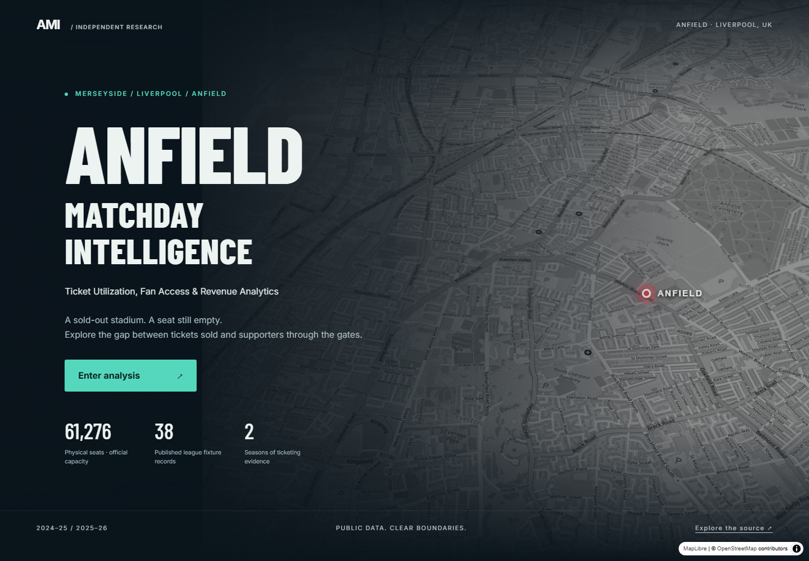
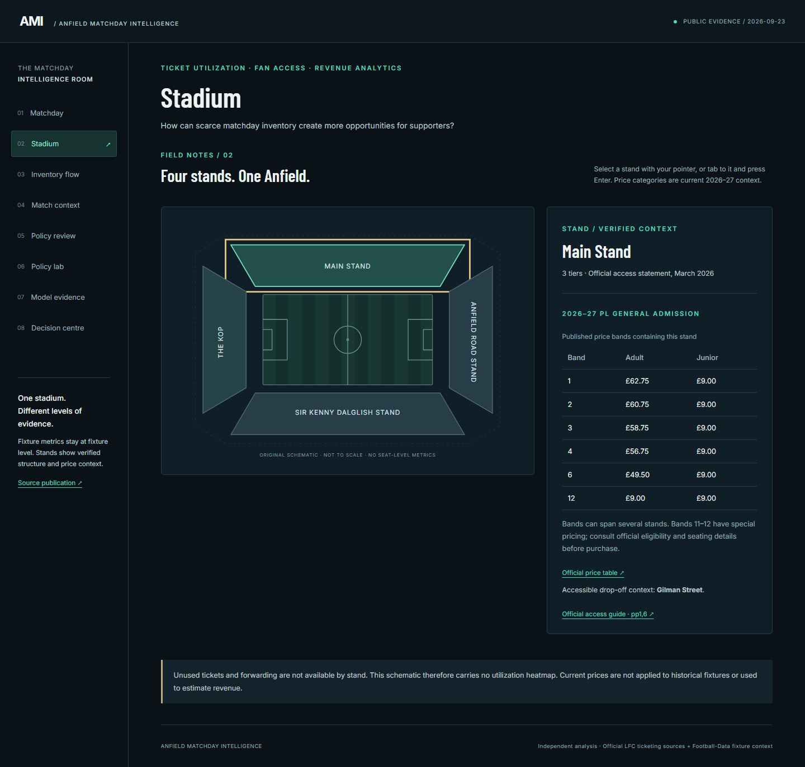
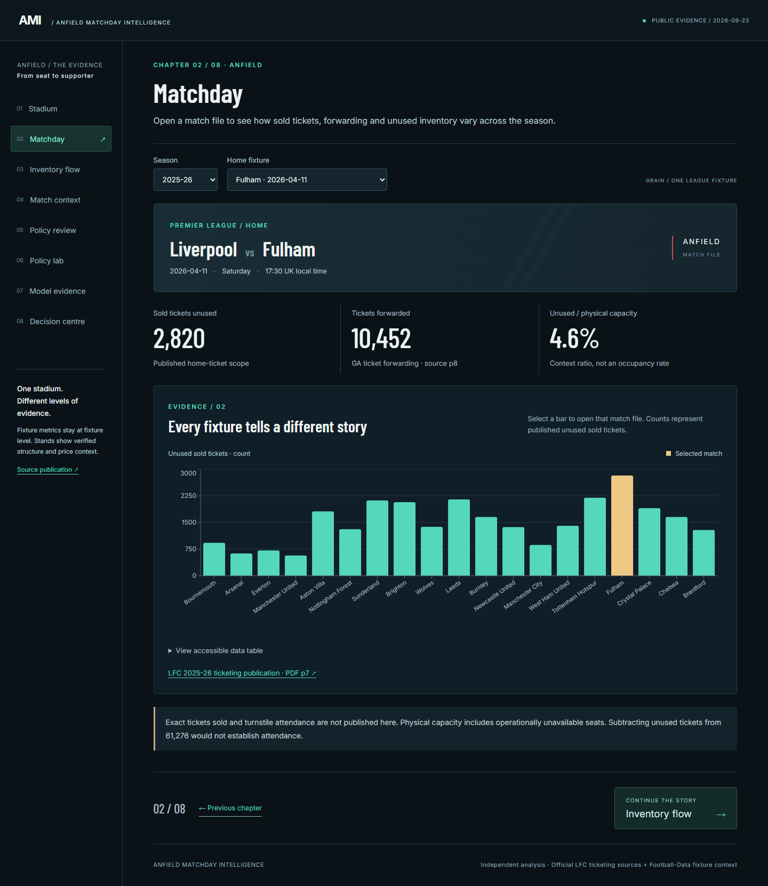
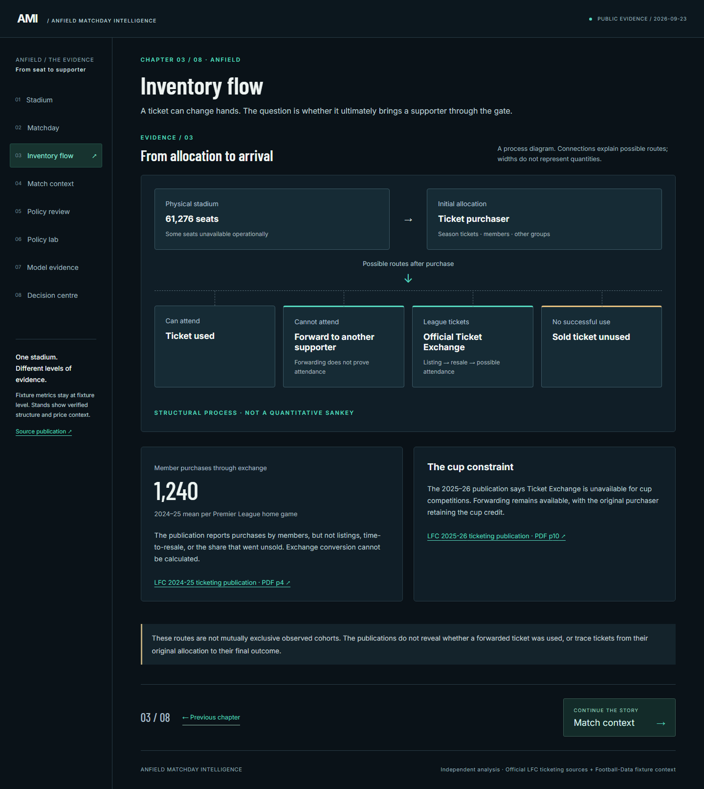
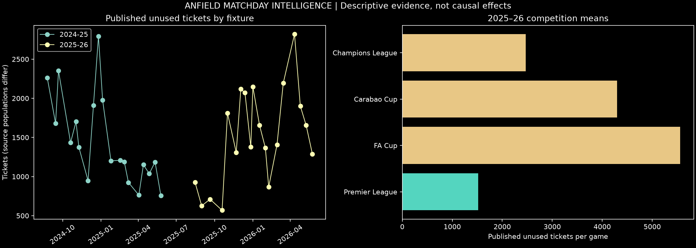
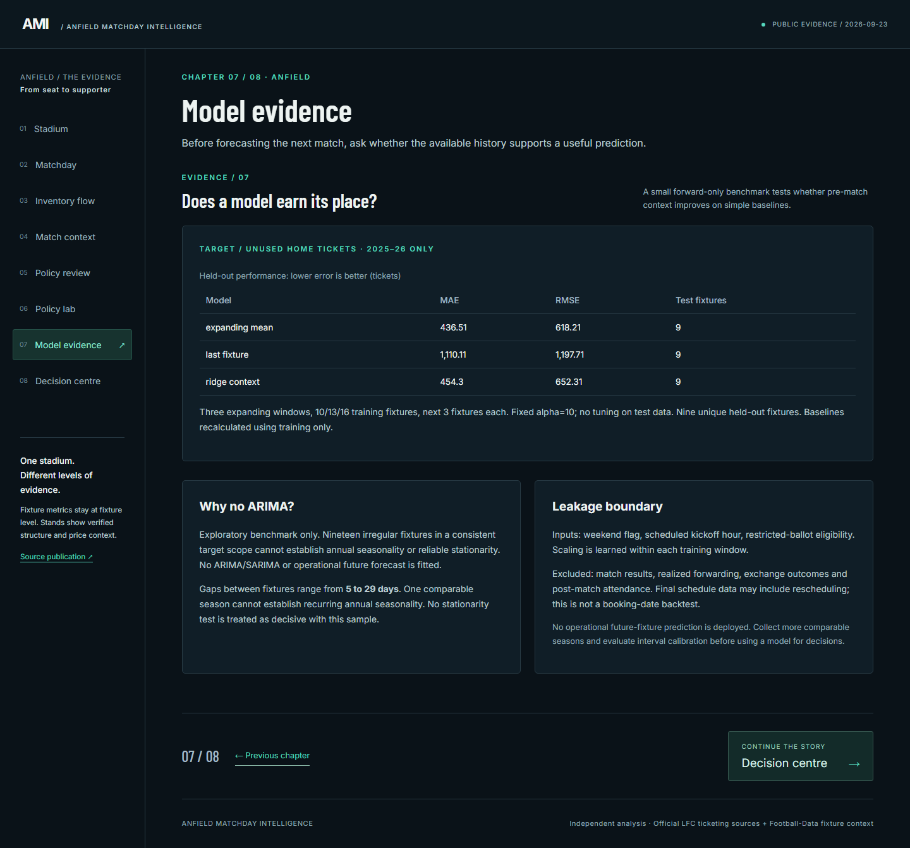
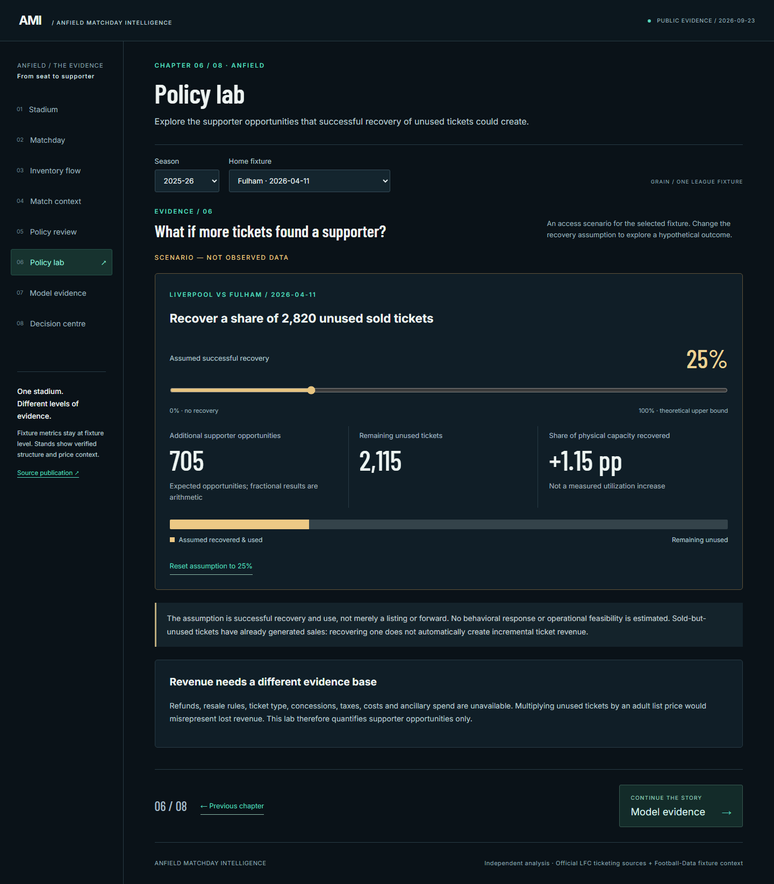

# Anfield Matchday Intelligence

<strong>Ticket utilization · Supporter access · Matchday analytics</strong>

<a href="https://thizisfranklin.github.io/Anfield-Stadium-Ticket-Value-Revenue/"><strong>Explore the live interactive project ↗</strong></a>

**A sold-out stadium. An unused ticket. Someone still trying to get in.** That's the question behind this project: how can a football club make better use of its limited ticket inventory so more supporters have a chance to attend?

I built this as an independent Liverpool FC case study using public club reports, Python, SQL, statistical analysis and an interactive React website. It is not affiliated with Liverpool FC.

## New to football (soccer)? Here's the context

Liverpool FC plays in the **Premier League**, England's top football division. Its home, **Anfield**, has a published physical capacity of **61,276 seats**. For many matches, demand is high, but a ticket that was already allocated or sold can still go unused. Supporters who cannot attend may be able to **forward** a ticket to another person or use the club's **Ticket Exchange**. Neither action necessarily tells us whether someone ultimately enters the stadium.

Think of it as an inventory and access problem: unlike online products or airline seats, a matchday seat expires when the match ends. There is no later opportunity to use that exact seat for that exact game.

### A little Liverpool history

Liverpool's story helps explain why so many people care about getting into Anfield. The club's official **Champions Wall** records its major men's trophies, including **20 English league titles**, **6 European Cups/UEFA Champions Leagues**, **8 FA Cups**, and **10 League Cups**. The league title decides England's champion; the European Cup/Champions League decides Europe's top club competition; the FA Cup and League Cup are separate English knockout competitions. <a href="https://www.liverpoolfc.com/history/honours">Full official honours list ↗</a>

 <em>Liverpool FC's Champions Wall, updated after the 2024–25 league title. Photo and further images: <a href="https://www.liverpoolfc.com/news/lfcs-champions-walls-updated-celebrate-20th-league-title">Liverpool FC</a>.</em>

Under **Bill Shankly**, Liverpool rebuilt into an English powerhouse in the 1960s and 1970s. **Bob Paisley's** era delivered sustained domestic and European success. The club's **2005 European Cup comeback in Istanbul** became a defining modern moment; **Jürgen Klopp's** team won Europe in 2019 and the league in 2019–20, before Liverpool captured a **20th league title in 2024–25** under Arne Slot. The history is context, not a variable in the analysis.

### The players behind the atmosphere

These official player portraits help give readers unfamiliar with Liverpool a sense of the people and culture around the club. They are football context only; **player performance isn't part of the dataset**.

<table>
<tr>
<td align="center" width="25%">
 <b>Florian Wirtz</b>
</td>
<td align="center" width="25%">
 <b>Alexander Isak</b>
</td>
<td align="center" width="25%">
 <b>Hugo Ekitike</b>
</td>
<td align="center" width="25%">
 <b>Bradley Barcola</b>
</td>
</tr>
</table>

Liverpool's recent history is also strongly associated with players such as **Mohamed Salah**, who left the club after the 2025–26 season following nine years at Anfield.

<em>Context only: official Liverpool FC-hosted imagery. No player-performance variables enter the project.</em>

## Why I made this

I've supported Liverpool since I was around five. Getting access to tickets is something I connect with personally, so I wanted to investigate what happens *around* the match rather than predict match results.

**My main question:** when ticket demand is constrained, what can public data tell us about unused seats, ticket forwarding and opportunities for more supporters to attend?

## Explore the website

This project isn't just a collection of notebooks. I built a connected **React application** to tell the story, from the stadium itself to fixture results, policy questions, prediction and possible next steps.

<table>
<tr>
<td width="50%"> <b>01 · Arrival</b> Meet the place before the numbers.</td>
<td width="50%"> <b>02 · Stadium</b> Explore four stands and understand the limited physical inventory.</td>
</tr>
<tr>
<td width="50%"> <b>03 · Matchday</b> Choose a season and fixture to inspect unused ticket counts.</td>
<td width="50%"> <b>04 · Ticket journey</b> See where forwarding and the Ticket Exchange fit in—and what isn't measured.</td>
</tr>
</table>

**[Open all eight interactive sections ↗](https://thizisfranklin.github.io/Anfield-Stadium-Ticket-Value-Revenue/)** — including match context, policy review, the scenario lab, model evidence and a decision centre.

## The data and what I found

I brought together two seasons of official Liverpool ticketing reports, plus public fixture dates and kickoff times. The validated core dataset has **38 Premier League home fixtures** (19 per season). The 2025–26 report also provides fixture-level ticket forwarding counts.

| Question | What the data showed |
| --- | --- |
| How many published tickets went unused? | **27,845** across 2024–25 league home fixtures and **28,821** across 2025–26; around **1,500 per match** in each season |
| How much ticket forwarding happened? | A published average of **9,926 forwarded tickets per 2025–26 home league match** |
| Did utilization improve between seasons? | No reliable like-for-like conclusion: the reports describe different ticket populations |
| Could a model predict unused tickets? | A simple historical-average benchmark made smaller errors than the Ridge model in this small test |

**A crucial distinction:** the older report refers to *all stadium tickets* while the newer one refers to *home tickets*. I haven't treated the difference between their totals as evidence that Liverpool improved or worsened.

### 1. Comparing similar opponents

I also compared the **16 opponents** that appeared in both seasons to reduce the influence of fixture mix. Their average published unused-ticket difference was **−1.6 tickets**; a bootstrap interval ran from **−386 to +367**. It's too broad to identify a clear change, and differing source definitions remain a limitation. Liverpool separately reported a **23% reduction in empty general-admission season-ticket seats** after its Every Seat, Every Game initiative—but that is a different subgroup, not proof of an overall or causal decline.

### 2. Testing whether machine learning helps

Using the **19 consistently defined 2025–26 fixtures**, I tested three approaches on **nine later, held-out fixtures**. All features were available before a match; later fixtures weren't used to train predictions for earlier fixtures.

| Forecasting approach | Average error (MAE) |
| --- | ---: |
| Expanding historical average | **437 tickets** |
| Ridge regression using match context | **454 tickets** |
| Last fixture's count | **1,110 tickets** |

The simplest approach did slightly better than Ridge in this evaluation. With such a small dataset, I wouldn't claim that a complex model is ready to forecast future matches.

### 3. What could unused seats mean for supporters?

Rather than call every unused ticket “lost revenue”—many were already sold—I built an interactive **what-if scenario**. Fulham's 2025–26 fixture had **2,820 published unused tickets**. If a hypothetical process successfully recovered and used 25% of those tickets, that would mean **705 additional supporter opportunities**. This is an illustration, **not an observed result or a forecast**.

## Where this could go next

The biggest gap isn't another model: it's what public reports can't show. To understand whether redistribution really works, the club would need to follow a ticket from **allocation → forwarding or exchange → new holder → stadium entry**. With that information, controlled tests of reminders or return policies could measure actual gains in supporter access.

The analysis deliberately **does not** invent stand-level unused seats, use today's prices as historical revenue, or treat policy changes as proven causes. For the full methods, sources and checks, see [data provenance](DATA_PROVENANCE.md), [reproduction steps](docs/REPRODUCTION.md) and [verified project claims](VERIFIED_PORTFOLIO_CLAIMS.md).

**Built with:** Python, pandas, SQL (SQLite and PostgreSQL), scikit-learn, Jupyter, React, Vite, Recharts and MapLibre. Tested using pytest, Playwright and GitHub Actions.

*Independent educational project. Liverpool FC photography and emblem are linked from official club pages for football context; those images are not used in the analysis. All rights remain with their respective owners. Not affiliated with or endorsed by Liverpool FC.*
